\# 07 - Ciclo de Vida

\## Objetivo

Este documento apresenta o ciclo de vida operacional de um paciente dentro da plataforma Luxora.

Seu objetivo é demonstrar a sequência natural dos estados pelos quais um atendimento evolui, permitindo que toda a plataforma compartilhe a mesma interpretação sobre o progresso da jornada clínica.

Este diagrama representa apenas o fluxo principal do MVP.

\---

\## Diagrama de Estados

```mermaid

stateDiagram-v2



&#x20;   \[\*] --> Novo



&#x20;   Novo --> Agendado



&#x20;   Agendado --> Confirmado



&#x20;   Confirmado --> EmSessao



&#x20;   EmSessao --> PagamentoPendente



&#x20;   PagamentoPendente --> Pago



&#x20;   Pago --> Alta

```

\---

\## Estados

\### Novo

Paciente recém-cadastrado na plataforma.

Ainda não possui uma sessão agendada.

\---

\### Agendado

Existe pelo menos uma sessão futura vinculada ao paciente.

Aguardando confirmação.

\---

\### Confirmado

A sessão foi confirmada pela clínica ou pelo paciente.

O atendimento encontra-se preparado para acontecer.

\---

\### Em Sessão

Representa o período em que o atendimento está acontecendo.

Durante esse estado podem ocorrer registros clínicos e eventos operacionais.

\---

\### Pagamento Pendente

O atendimento foi concluído.

Existe uma cobrança aguardando liquidação financeira.

\---

\### Pago

A cobrança foi integralmente liquidada.

O fluxo financeiro da sessão encontra-se encerrado.

\---

\### Alta

O paciente encerrou sua jornada clínica.

Não existem atendimentos pendentes relacionados ao tratamento.

\---

\## Regras Gerais

O ciclo de vida segue alguns princípios.

\- Os estados representam a evolução natural da jornada do paciente.

\- Um estado somente pode avançar para estados válidos.

\- Toda transição deve gerar eventos internos da plataforma.

\- Mudanças de estado devem ser auditadas.

\- Nenhuma transição pode ignorar regras de negócio.

\---

\## Eventos Esperados

Durante o ciclo poderão ser produzidos eventos como:

\- PacienteCriado

\- SessaoAgendada

\- SessaoConfirmada

\- SessaoIniciada

\- SessaoFinalizada

\- CobrancaGerada

\- PagamentoRecebido

\- PacienteRecebeuAlta

Esses eventos serão utilizados futuramente pelo Operational Engine e pelos processos de automação.

\---

\## Escopo

Este documento descreve apenas a evolução dos estados operacionais.

Não contempla:

\- Fluxos de autenticação;

\- Fluxos financeiros completos;

\- Exceções;

\- Cancelamentos;

\- Reagendamentos;

\- Regras específicas da clínica.

Esses cenários possuem documentação própria.

\---

\## Documentos Relacionados

\- 01 - Visão Geral

\- 02 - Diagrama ER

\- 03 - Domínio

\- 04 - Multi-Tenant

\- 05 - Auditoria

\- 06 - Relacionamentos

\- 08 - Fluxo de Dados

\---

\## Observações

Este ciclo representa a jornada padrão da plataforma Luxora.

Novos estados poderão ser adicionados futuramente conforme novos módulos forem incorporados ao sistema.

Toda alteração deverá preservar a consistência da máquina de estados e manter compatibilidade com o Operational Engine.

