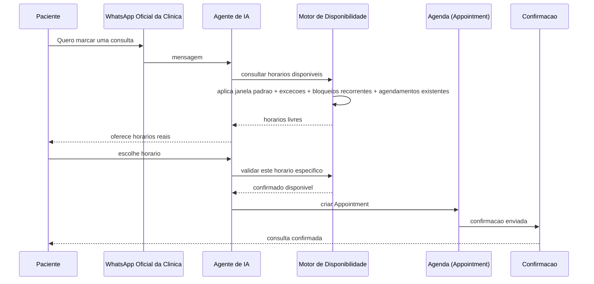
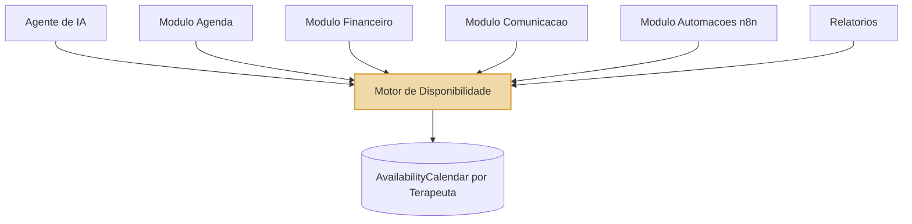

# PD-001 — Diagrama: Fluxo Oficial do Motor de Disponibilidade

## Fluxo de agendamento (Fase 1 em diante)

## Autoridade central — nenhum atalho

Leitura: todo módulo desenha uma seta PARA o Motor, nenhum módulo desenha uma seta direto pro banco de disponibilidade. Essa é a regra visual que resume o PD-001 inteiro.
